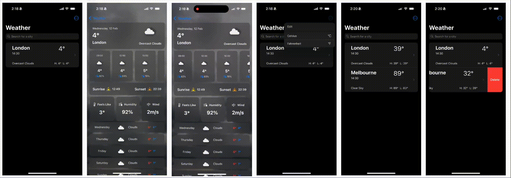

# Weatherly 🌤️

## Description
Weatherly is an iOS weather application that provides real-time weather information with a dynamic user interface. The app offers detailed weather forecasts, hourly updates, and 
comprehensive weather metrics while adapting its appearance based on current weather conditions and time of day.
<br>


## Features 🌟
- **Real-time Weather Data**: Get current weather conditions from OpenWeatherMap API
- **Location Search**: Search and save multiple locations for weather tracking
- **Dynamic Theming**: Background changes based on weather conditions (clear sky, rain, snow, etc.)
- **Temperature Unit Toggle**: Switch between Celsius and Fahrenheit
- **Detailed Weather Metrics**:
  - Current temperature with feels-like conditions
  - Humidity levels
  - Wind speed
  - Sunrise and sunset times
- **Forecast Features**:
  - Hourly forecast for the next 10 hours
  - 5-day weather forecast
  - Detailed temperature ranges (high/low)
- **List Management**:
  - Swipe to delete locations
  - Reorder locations
  - Edit mode for bulk management
- **Responsive Design**: Adapts to different iOS devices and orientations

## Tech Stack 💻
### Frontend
- SwiftUI
- Async/Await for concurrent operations
- Combine framework for reactive programming

### Backend Integration
- OpenWeatherMap API
- RESTful API integration
- JSON parsing with Codable

### Architecture & Patterns
- MVVM (Model-View-ViewModel) architecture
- Observable Object Pattern
- Repository Pattern for data management
- Dependency Injection

### Data Persistence
- @AppStorage for user preferences
- CoreLocation for geographical data

## Deployment 🚀
### Requirements
- iOS 16.0 or later
- Xcode 14.0 or later
- Swift 5.0
- Active internet connection

### Installation
- **Clone** the repository
```bash
  git clone https://github.com/tanmayxx12/Weatherly
```

- Open the project in **XCode**
``` bash
  open Weatherly.xcodeproj
```
